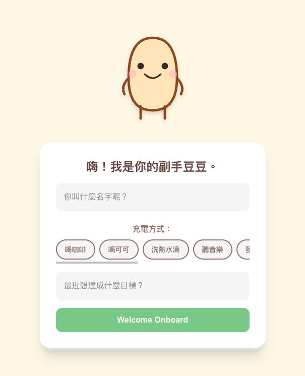
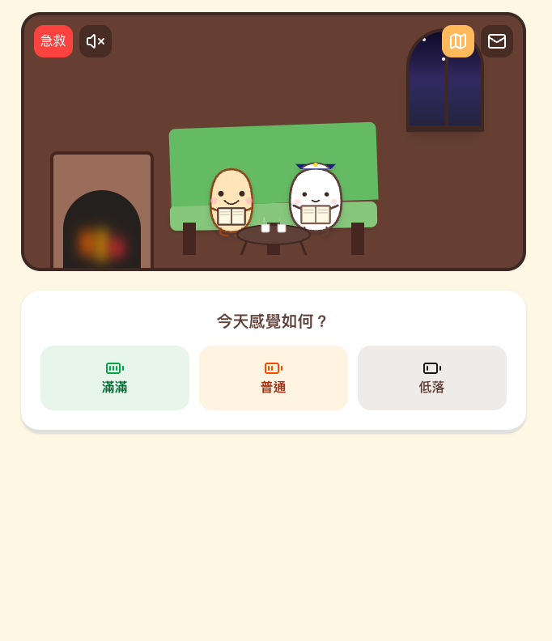
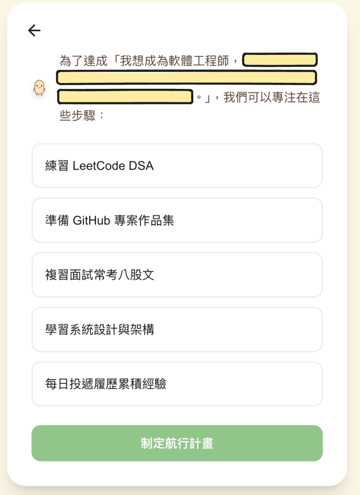

# Gemini Anxiety Management Agent with RoR/ReactJS

#### First Page


#### Room View


**Regain your focus and peace of mind through AI-driven automation.**

In an era of information overload and rapid AI advancement, "AI Anxiety" is real. This project is a specialized **decoupled full-stack application** built with **Ruby on Rails (API backend)** and **React.js (Vite frontend)**, powered by the **Google Gemini API**. It is designed to help users manage stress, filter digital noise, and provide actionable insights to turn anxiety into productivity.

---

## Key Features

* **Smart Anxiety Filtering:** Automatically categorizes stressors and prioritizes them using Gemini's advanced reasoning.
* **Proactive Automation:** Don't just talk to a chatbot; this agent automates the "next steps" to reduce your mental load.
* **Emotional Trend Analysis:** Tracks your input over time to identify triggers and suggest personalized coping strategies.
* **Gemini 1.5 Flash Integration:** Optimized for speed and responsiveness, ensuring support is there exactly when you need it.

## Hybrid Routing & Guardrails
To ensure stable, high-quality output even when facing unstructured noise or emotional input, this project implements a two-stage AI routing architecture processed securely on the Rails backend:



* *Note: Yellow highlights indicate simulated emotions used for testing system robustness.*

* **Intent Extraction:** The initial classifier cold-filters through emotions to precisely identify the user's core objectives (e.g., specific career goals).

* **Expert Guardrails:** Based on the identified intent, the system dynamically injects domain-specific rules. This blocks meaningless AI slogans and ensures the final output consists of specialized, actionable steps.

---

## Getting Started

Because this is a decoupled architecture, you will need to run the backend and frontend servers simultaneously.

### Prerequisites

* Ruby (v3.3.1 or later recommended)
* Node.js (v20.x or later recommended)
* A Google AI Studio API Key. [Get it here](https://aistudio.google.com/).

### Installation & Configuration

**1. Clone the repository:**
```bash
git clone [https://github.com/your-username/ai-anxiety-agent-ror-react.git](https://github.com/your-username/ai-anxiety-agent-ror-react.git)
cd ai-anxiety-agent-ror-react
```

**2. Setup the Backend (Ruby on Rails):**
```bash
cd backend
bundle install
```

Create a `.env` file in the root directory:

```env
GEMINI_API_KEY=your_api_key_here
```

**3. Setup the Frontend (React / Vite):**
```bash
cd ../frontend
npm install
```

### Running the App
You will need two terminal windows to run both servers.
#### Terminal 1 (Backend):
```bash
cd backend
rails server
# The API will run on http://localhost:3000
```

#### Terminal 2 (Frontend):
```bash
cd frontend
npm run dev
# The React app will run on http://localhost:5173
```

Open http://localhost:5173 in your browser to start using the app!


## License

Distributed under the MIT License. See `LICENSE` for more information.

---

**Built with ❤️ for a calmer digital world.**